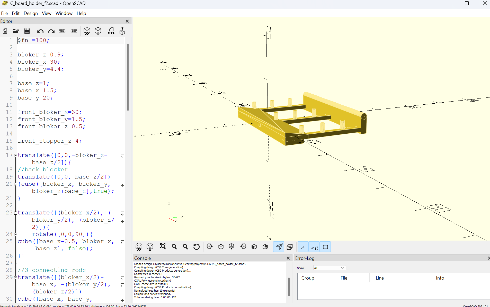

# cutting-board-holder

A parametric 3D-printable mounting bracket designed in OpenSCAD and optimized for slicing in Ultimaker Cura. This component features robust structural alignment pins, integrated cross-bracing rods, and an angled structural base to securely hold circuit boards or hardware components in place.

---

## Key Features

* **Parametric Design:** Built entirely with variables in OpenSCAD, allowing you to easily adjust dimensions like material thickness (`base_z`), width (`bloker_x`), and depth (`base_y`) to fit different board scales.
* **Integrated Alignment Pins:** Features a matrix of 9 vertical reinforcement and positioning pins (`cylinder` elements) to keep the mounted board perfectly aligned.
* **Structural Reinforcement:** Uses an angled wedge base generated via custom `polyhedron` meshes to add rigidity against bending without using excess filament.
* **Print-Ready Geometry:** Includes a smooth, rounded front lip (`cylinder` rotation) to avoid sharp edges and ensure a clean print transition on the bed.

---

## Technical Details

### OpenSCAD Implementation
The design splits the model logic into modular components rather than generating a single complex solid:
1. **The Foundation:** Utilizes three distinct cross-connecting rods (`cube` primitives) to distribute load evenly across the mounting surface.
2. **The Back Blocker:** Implements a solid rear wall with exact center translations to provide a firm backstop for the hardware.
3. **The Polyhedron Wedge:** Implements an advanced 3D wedge structure by manually mapping a 6-point coordinate array (`tri_points`) across a 5-face index layout (`tri_faces`).

### Slicer Configuration (Cura)
The model has been fully validated in Ultimaker Cura for a **Creality CR-10S** with the following baseline settings:
* **Nozzle:** 0.4mm Nozzle
* **Profile:** Standard Quality - 0.2mm layer height
* **Infill:** 15% (optimal for structural strength and material efficiency)
* **Material:** Generic PLA

---

## Project Structure

* `C_board_holder_f2.scad`: The source parametric CAD code file.
* `C_board_holder_v4.stl`: The compiled, high-polygon mesh export ready for slicing.

---

## Getting Started

1. **Customize the Design:** Open `C_board_holder_f2.scad` in **OpenSCAD**. Adjust variables at the top of the script (lines 3–15) to change dimensions.
2. **Render and Export:** Press `F6` to render the geometry, then click **Export as STL**.
3. **Slice and Print:** Import the generated `.stl` file into **Cura** or your preferred slicer, apply standard PLA settings, and slice.
